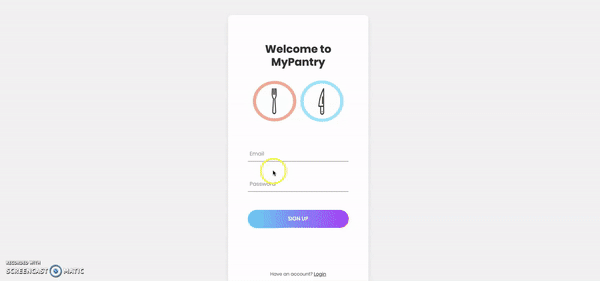

# MyPantry v0.1

## Description
MyPantry is a web application that help users to track groceries. This application uses the Spoonacular api to retrieve recipes acoording to the grocery saved by the user. This app consists of login functionality which helps personalize the experience

## Challenges  
Our biggest challenges on this project were working with Lint and Travis to get checks to pass. We also had issues with Spoonacular api integration as it was always returning random results everytime. However, working together we were able to solve the issues as a team.

## Future Versions
* Adding receipt scanner to experdite the process.
* Integrate with delivery partners to help order groceries directrly from app.
* Create a CMS to manage users.

## Tech 
 API for recipes: Spoonacular; Sequelize, MySQL, Passport, Bulma, Express, Express Handlebars, ESLint, Travis.

## Deployed URL
https://shielded-harbor-38774.herokuapp.com/

##
Github Repo https://github.com/Hot-Fixers/Project2
***

## Credits
Plaid pattern from http://thepatternlibrary.com/#plaid  
Logo created with freelogodesign.org 
Login form design https://colorlib.com/wp/template/login-form-v2/ 
Styling and layout css library https://bulma.io/

***

## Contributing
* [Mohmedvaid](https://github.com/Mohmedvaid)
* [julzar](https://github.com/julzar)
* [JIllWesterfelhaus](https://github.com/JIllWesterfelhaus)

